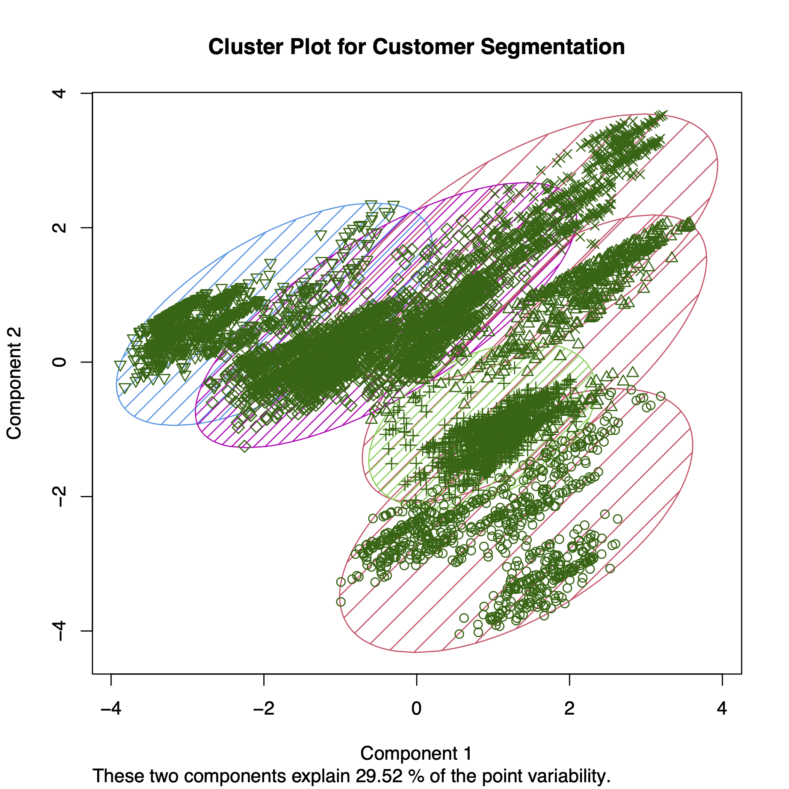

# Customer Segmentation Cluster Analysis in R
- Author: Amelia Tang 

## About

This project aims to identify customer segments using a sample customer information dataset. The dataset contains 6718 rows of non-null data. To conduct the customer segmentation analysis, I utilized the k-means clustering algorithm and implemented the algorithm in R. 

After clustering the data, the clusters are visualized using `clusplot`. Clusplot employs PCA for visualizing the data, utilizing the first two principal components to represent and elucidate the data.

## Reports 
[EDA Report using `ggplot2`](doc/Customer_Segmentation_EDA_Report.pdf)

## Usage

There are two suggested ways to run this analysis:

#### 1. Using Docker
TBU
#### 2. Without using Docker
TBU

## Dependencies
TBU 
